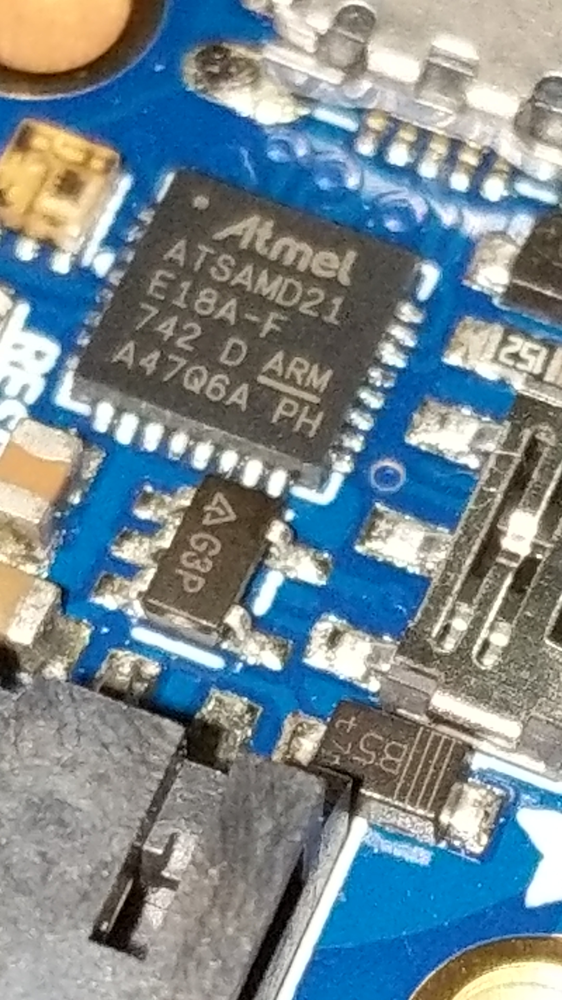
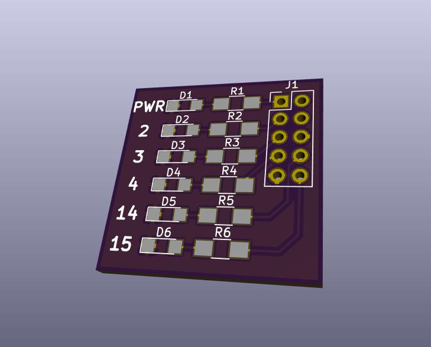

:skip-help: true
:css: slides.css

.. title: Micropython And Friends

----

=======================
Micropython and Friends
=======================

May 17, 2018
============

Rob Ludwick
===========

----

Who am I?
=========

BS Computer Engineering, Iowa State University

Software engineer

Travelling to KC for the last two years

----

Why?
====

Spent many a night bored in a hotel room.

Wanted to get back into electronics again.

----

.. image:: https://static.boredpanda.com/blog/wp-content/uploads/2017/08/bored-people-too-much-time-on-hands-24-599fc8ef396ca__700.jpg
    :height: 1024
    :align: left

----

.. image:: https://static.boredpanda.com/blog/wp-content/uploads/2017/08/599ec59097c00_SiZaJo3r__700.jpg
    :height: 1024
    :align: left

----

.. image:: https://static.boredpanda.com/blog/wp-content/uploads/2017/08/Bored-People-Too-Much-Time-On-Hands-101-599ff1c47f4fa__700.jpg
    :height: 1024
    :align: left

----

Electronics?
============

* 1/2 of CprE degree was coding

* 1/2 was electronics

Pretty much most of the last several years were software
--------------------------------------------------------

----

Hobby Renaissance
=================

Kind of an interesting swing towards electronics as of late

* Shenzen
* Adafruit
* Soldering
* KiCad
* Micropython
* IoT

----

Small/Fast/Cheap Microcontrollers
=================================

* ARM

  * STM32FXXX
  * SAMD21
  * Broadcom SoC for RPI

----

Small/Fast/Cheap Microcontrollers
=================================

* EspressIF ESP32/ESP8266

    * Wifi built in
    * FCC approved modules

.. image:: https://cdn-shop.adafruit.com/970x728/3269-06.jpg
    :height: 600
    :align: left

----

IoT python platforms
====================

* Rasbperry Pi Python libaries (linux)
* MicroPython (esp32, esp8266)
* CircuitPython (samd21)

----

GPIO Pin
========

General Purpose Input Output Pin
--------------------------------

A pin that can be used to either read from the pin
or write to the pin.

----

3 Types of Signals
==================

High, Low and Disconnected (or floating or Hi-Z).

* High is +V

* Low is GND

----

Simple Raspberry PI GPIO Board
==============================

.. raw:: html

  <iframe width="300" height="500" src="https://www.youtube.com/embed/REsm_jIVMjg" frameborder="0" allow="autoplay; encrypted-media" allowfullscreen></iframe>

----

----

RPI Board IO
============

.. image:: https://www.raspberrypi-spy.co.uk/wp-content/uploads/2012/06/Raspberry-Pi-GPIO-Layout-Model-B-Plus-rotated-2700x900.png
    :width: 1000
    :align: left

----

RPi.GPIO
========

.. code-block:: python

    import RPi.GPIO as GPIO
    import time

    pins = [2, 3, 4, 14, 15]
    def main():
        GPIO.setmode(GPIO.BCM)
        GPIO.setwarnings(False)
        GPIO.setup(pins, GPIO.OUT)

        while True:
            for pin in pins:
                GPIO.output(pin, GPIO.HIGH)
                time.sleep(0.2)

            for pin in pins:
                GPIO.output(pin, GPIO.LOW)
                time.sleep(0.2)

    if __name__ == "__main__":
        main()

----

PWM, Duty Cycle
===============

* Pulse Width Modulation controls the pulse length of a square wave.

* Duty Cycle is the ratio of the "ON"

    * 50% duty cycle is half on / half off
    * 100% duty cycle is all on.
    * 75% duty cycle is 75% of the time the pulse is on, 25% of the time it is off.

----

PWM, Duty Cycle
===============

* PWM is used to control motors

* Can change the brightness of an LED

----

SPI, I2C
========

Relatively popular data bus protocols.

Useful for hooking up external devices.

